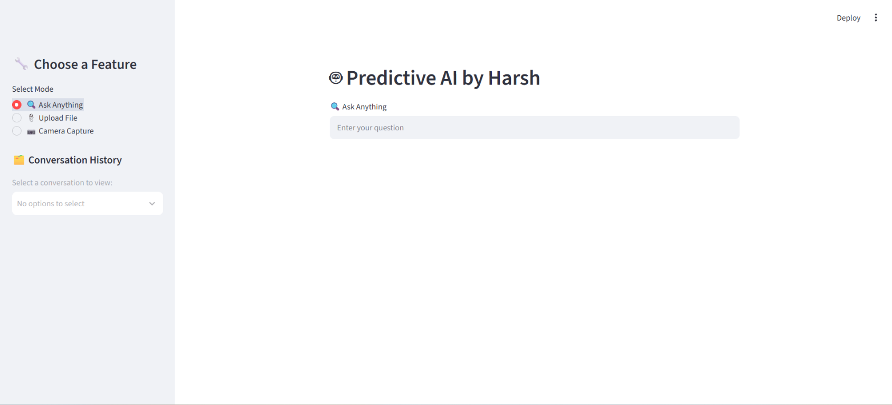
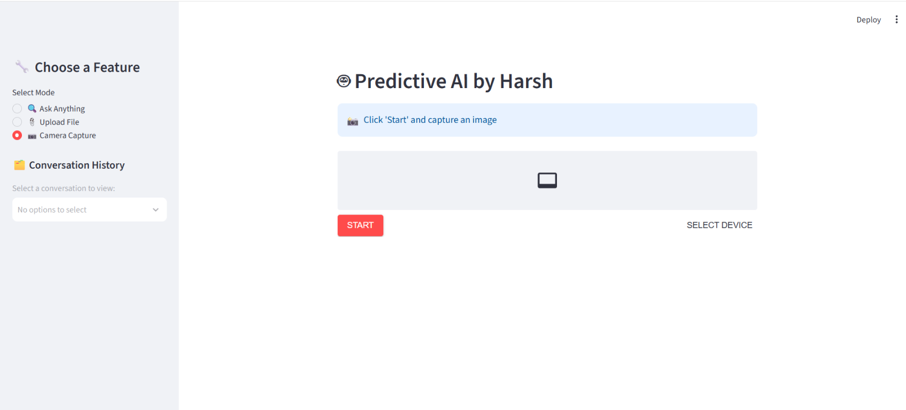

# Smart Search & Analyzer

A browser-based AI workspace for chatting with Groq, summarizing PDF and Word documents, asking questions about images, and describing a camera capture. The Vercel version uses **bring your own Groq API key**: each visitor connects their own account when the app opens.

> **Demo project:** Model responses may be incorrect. Do not use them as professional advice or upload information you do not have permission to share.

## Features

- **Ask anything:** multi-turn chat with Groq.
- **Analyze a document:** extract text from PDF and DOCX files in the browser, preview it, and ask for a summary or specific answer. The answer opens in the chat workspace.
- **Ask about an image:** upload a PNG or JPEG and send it to Groq's vision model. The answer opens in the chat workspace.
- **Camera:** preview the camera locally, capture a frame, and ask Groq to describe it in the chat workspace.
- **BYO API key:** enter a Groq key at startup. It is validated with Groq, then held in the current browser tab's `sessionStorage`; there is no shared application key or server-side key database.
- **Conversation history:** chats, document analyses, and camera descriptions are listed in the sidebar and saved in this browser. Select a saved chat to continue it, or start a new one with **+**.
- **Readable responses:** headings, emphasis, lists, code, and links are formatted for reading rather than shown as Markdown source.

### Important feature limitations

- Scanned PDFs without selectable text are not OCR'd.
- Document extraction and image resizing happen in the browser. The extracted document text or captured/uploaded image is sent to Groq when you request an analysis.
- Chat history is saved in this browser's local storage, not synced between devices or accounts. Images are not saved with history; re-upload them to ask follow-up image questions.
- The Vercel version uses Groq's multimodal `qwen/qwen3.8-27b` model for both text and image requests. Groq model availability and account access can change; check the [Groq model catalog](https://console.groq.com/docs/models) if the model is unavailable.

## Screenshots

These screenshots show the original Streamlit interface. The Vercel version has a separate responsive web interface.

### Ask Anything



### Camera Capture



## Deploy to Vercel

### Dashboard deployment (recommended)

1. Push this repository to GitHub and sign in to [Vercel](https://vercel.com/).
2. In the Vercel dashboard, select **Add New → Project** and import `HP04Harsh/Smart-Search-Analyzer`.
3. Keep the repository root as the project root. Vercel uses the included `vercel.json` and `package.json`:
   - Framework preset: **Vite**
   - Build command: `npm run build`
   - Output directory: `dist`
4. Select **Deploy**. No Groq key needs to be added to Vercel Environment Variables.
5. Open the generated deployment URL. Each visitor is asked for their own Groq key when the page loads.

When Git integration is enabled, pushes to the production branch trigger new deployments automatically.

### Deploy with the Vercel CLI

Install Node.js 20.19 or newer and npm, then run:

```bash
npm install
npx vercel login
npx vercel link
npx vercel --prod
```

Choose the intended Vercel account and project when prompted. The Vercel CLI can also run the app locally with the deployed API functions:

```bash
npx vercel dev
```

The `/api/validate` and `/api/chat` Node.js functions are deployed alongside the Vite frontend. Camera access is available on HTTPS deployments and on localhost.

## How API key handling works

1. A visitor pastes a key from [Groq Console → API Keys](https://console.groq.com/keys).
2. The browser sends it over HTTPS to `/api/validate`, which checks it with Groq.
3. After validation, the key is held in that tab's `sessionStorage` and sent in the `Authorization` header when that visitor makes a request.
4. Vercel relays the request to Groq. The API functions do not write visitor keys to files, databases, or application logs.
5. Closing the tab clears its session storage. Use **Groq API connected** in the sidebar to disconnect and remove a key earlier.

The key necessarily passes through the Vercel function to reach Groq. Treat it as a credential, do not paste it into chat, and use your own key only on a deployment you trust. A browser extension or compromised device can access browser storage. A key entered on the public site is not an application-wide key; every visitor must use their own.

## Run locally

### Vercel web app

```bash
npm install
npm run dev
```

The included Vite middleware serves the same-origin `/api` handlers locally. Alternatively, run them through the Vercel CLI:

```bash
npx vercel dev
```

`npm run dev` runs the Vite frontend and the included local API middleware. `vercel dev` runs the app through Vercel's development server. Sign in with `npx vercel login` and link a project with `npx vercel link` if the CLI requests it.

To check the static production build:

```bash
npm run build
```

### Original Streamlit app

The repository also retains the original Python/Streamlit application in [`main.py`](./main.py). It is a separate local app and uses a local Streamlit secret instead of the Vercel BYO-key prompt.

```bash
python -m venv .venv
# Windows PowerShell:
.\.venv\Scripts\Activate.ps1
# macOS / Linux:
source .venv/bin/activate

python -m pip install --upgrade pip
pip install -r requirements.txt
```

Create `.streamlit/secrets.toml` locally:

```toml
[groq]
api_key = "YOUR_GROQ_API_KEY"
```

Then run:

```bash
streamlit run main.py
```

Open [http://localhost:8501](http://localhost:8501). Never commit `.streamlit/secrets.toml`; it is ignored by Git.

## Cost

This repository does not charge users. Usage costs depend on the account and services used:

| Cost | Notes |
| --- | --- |
| Groq API | Each visitor pays or uses quota on their **own Groq account**. Pricing, model availability, rate limits, and any free tier can change. Check [Groq pricing](https://groq.com/pricing) and the usage dashboard. |
| Vercel | Hosting and function charges, if any, apply to the Vercel project owner under their current plan and usage. Check [Vercel pricing](https://vercel.com/pricing). |
| Local development | No hosting fee when running on your own computer; internet and electricity are still required. |

For a model priced per token, estimate a request as:

```text
(input tokens / 1,000,000 × current input price per 1M tokens)
+ (output tokens / 1,000,000 × current output price per 1M tokens)
```

Document size, image processing, prompts, and response length affect usage. This project does not display token counts or estimate bills. Check the provider dashboards for actual charges; fixed prices are intentionally omitted because rates and quotas can change.

## Project structure

```text
.
├── api/
│   ├── chat.js             # Validates request and relays chat/image requests to Groq
│   └── validate.js         # Checks a visitor's API key with Groq
├── src/
│   ├── main.js             # Browser UI, file extraction, and camera handling
│   └── style.css
├── screenshots/            # Original Streamlit screenshots
├── index.html
├── package.json
├── vercel.json
├── main.py                 # Original Streamlit app
└── requirements.txt
```

## Troubleshooting

- **Invalid key:** create or rotate a key in [Groq Console](https://console.groq.com/keys), then reconnect it from the app.
- **Model unavailable:** check [Groq's model catalog](https://console.groq.com/docs/models). The configured model ID is in `api/chat.js`.
- **Too many requests:** check the Groq account's rate limits and usage. The app does not provide or pool API quota.
- **Camera is blocked:** allow camera permission; remote sites must use HTTPS.
- **Scanned PDF has no text:** the current app extracts selectable text but does not perform OCR.
- **Vercel build or function fails:** confirm the project root is the repository root, the framework is Vite, and the Node.js runtime meets the `package.json` requirement.
- **Text or image exceeds request limits:** use a smaller document or image. Very long documents may also exceed the model's context window.

## Security

- Never commit API keys, `.env` files, or `.streamlit/secrets.toml`.
- Revoke a key immediately if it is disclosed in chat, screenshots, source code, logs, or Git history.
- Text prompts, extracted document text, and images are sent to Groq only when the visitor requests an analysis.
- Vercel receives each key as a request header to proxy the API call; the app does not intentionally persist it on the server.
- Treat provider responses as untrusted and verify important information independently.
