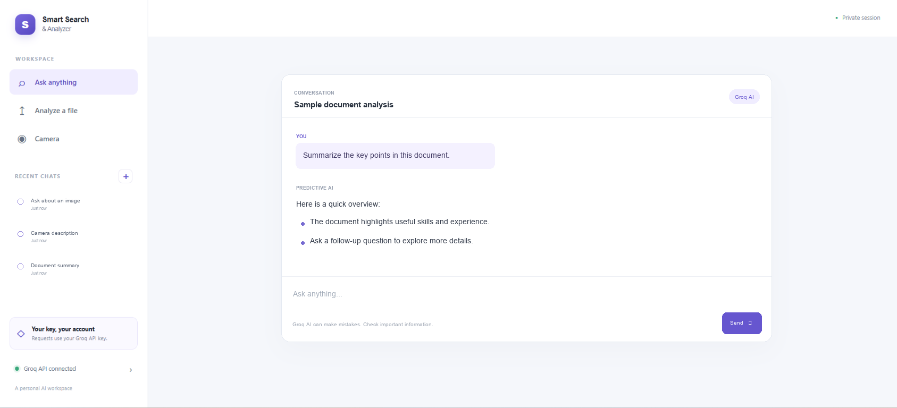

# Smart Search & Analyzer

**A private, Groq-powered AI workspace for chat, document analysis, and image understanding.**

[](https://smart-search-analyzer.vercel.app)
[](LICENSE)
[](https://nodejs.org/)

> **Open the app:** [smart-search-analyzer.vercel.app](https://smart-search-analyzer.vercel.app)
>
> **Get a Groq API key:** [console.groq.com/keys](https://console.groq.com/keys)

Each visitor brings their own **Groq API key (BYOK)**. There is no shared key to configure in Vercel.

## Preview

<p align="center">
  
</p>

## What it does

| Feature | How it works |
| --- | --- |
| **Ask anything** | Chat with Groq's `qwen/qwen3.8-27b` multimodal model. Replies are rendered with formatted headings, emphasis, lists, links, and code. |
| **Analyze documents** | Extract selectable text from PDF and DOCX files in your browser, preview it, and ask questions or request a summary. Results open in the chat workspace. |
| **Understand images** | Upload a PNG or JPEG and ask questions about it. Images are resized in the browser before being sent to Groq. |
| **Camera** | Preview a webcam locally, capture a frame, and ask Groq to describe it. Remote camera access requires HTTPS and your browser's permission. |
| **Recent chats** | Visit previous conversations from the sidebar. History is stored in your browser and remains available after a page reload. |
| **Bring your own key** | Connect and validate your own Groq key when the app opens. The key is never shared with other visitors. |

**Current limitations:** scanned PDFs without selectable text are not OCR'd; image files and webcam captures are not retained in chat history; saved chats stay in the current browser and are not synced to an account or another device.

## Start using the live app

1. Open [Smart Search & Analyzer](https://smart-search-analyzer.vercel.app).
2. Create or sign in to a Groq account at [console.groq.com](https://console.groq.com/).
3. Create a key in [Groq Console → API Keys](https://console.groq.com/keys).
4. Paste the key into the app's **Connect your model** prompt.
5. Choose **Ask anything**, **Analyze a file**, or **Camera**.

Groq provides API access with a **free developer tier and usage limits**, subject to the current account eligibility, model availability, and rate limits. Check [Groq's current rate limits](https://console.groq.com/docs/rate-limits) and account usage before relying on free access. Higher usage or different account terms may incur charges. Creating a key does not mean unlimited or permanently free inference.

## Download and run locally

### Requirements

- [Node.js 20.19 or newer](https://nodejs.org/en/download) and npm
- A Groq account and API key for live AI requests
- A modern browser

### Windows (PowerShell)

```powershell
git clone https://github.com/HP04Harsh/Smart-Search-Analyzer.git
Set-Location Smart-Search-Analyzer
npm install
npm run dev
```

### macOS and Linux

```bash
git clone https://github.com/HP04Harsh/Smart-Search-Analyzer.git
cd Smart-Search-Analyzer
npm install
npm run dev
```

Open the local URL printed by Vite (usually [http://localhost:5173](http://localhost:5173)), enter your Groq API key, and start using the app. The local Vite middleware provides the `/api` routes as well as the frontend.

To run the checks and create a production build:

```bash
npm test
npm run build
npm run preview
```

To run the Vercel development environment instead of Vite's local API middleware:

```bash
npx vercel login
npx vercel link
npx vercel dev
```

## How the BYOK flow works

1. The browser sends the key over HTTPS to the app's `/api/validate` endpoint. The function checks it with Groq.
2. After successful validation, the key is held in the current tab's `sessionStorage`.
3. When you send a prompt, the browser sends the key in the `Authorization` header to the same-origin Vercel function. That function forwards the request to Groq.
4. The app does not intentionally write visitor keys to its database, source files, or application logs. The key necessarily passes through the Vercel function to reach Groq.
5. Closing the browser tab removes its session key. Use the connected-key control in the sidebar to disconnect sooner.

Prompts and extracted document text, uploaded images, and camera captures are sent to Groq when you request an analysis. Saved chat text is stored in the current browser's local storage. Do not paste keys into chat or use the app on a device you do not trust. Revoke a key immediately if it is exposed.

## Cost

| Service | Who pays |
| --- | --- |
| **Groq inference** | Each visitor uses their own Groq account, limits, and any applicable charges. See [Groq rate limits](https://console.groq.com/docs/rate-limits) and the [Groq Console](https://console.groq.com/). |
| **Vercel hosting** | The project owner is responsible for Vercel project usage under the current plan. Check [Vercel pricing](https://vercel.com/pricing). |
| **Local use** | No hosting fee when run on your own machine. Internet and device costs still apply. |

Costs and free-tier availability can change. This app does not meter tokens or estimate a bill; use your provider dashboards to review actual usage.

## Deploy your own copy to Vercel

1. Fork this repository on GitHub.
2. In [Vercel](https://vercel.com/), choose **Add New → Project** and import your fork.
3. Use the repository root as the project root. The included [`vercel.json`](vercel.json) sets the Vite framework, `npm run build`, and the `dist` output directory.
4. Deploy. **Do not add a shared Groq key** to Vercel environment variables: visitors enter their own key in the app.

To deploy from a local checkout, sign in and link the project with the Vercel CLI, then run:

```bash
npm install
npx vercel login
npx vercel link
npx vercel --prod
```

## Project layout

```text
.
├── api/
│   ├── chat.js             # Validates requests and proxies text/image requests to Groq
│   └── validate.js         # Checks a visitor's Groq API key
├── public/
│   └── favicon.svg
├── screenshots/
│   └── app-preview.png     # Current Vercel app screenshot
├── src/
│   ├── main.js             # Chat, history, document extraction, and camera flows
│   └── style.css
├── tests/
│   └── api.test.js
├── index.html
├── package.json
└── vercel.json
```

The repository also contains `main.py` and `requirements.txt` for the original Streamlit prototype. The public Vercel application described above is the Node.js/Vite version.

## Troubleshooting

- **Invalid API key:** create a new key in [Groq Console](https://console.groq.com/keys), then reconnect it. Revoke keys exposed in messages, screenshots, logs, or source files.
- **Model unavailable or rate limited:** check the account's access and current [Groq rate limits](https://console.groq.com/docs/rate-limits). Model access can change.
- **Camera does not start:** allow browser camera access; hosted websites need HTTPS.
- **PDF appears empty:** scanned PDFs require OCR, which this project does not currently provide.
- **Local API does not respond:** start the project with `npm run dev` from the repository root, or use `npx vercel dev`.

## License

Released under the [MIT License](LICENSE). See the license file for the complete terms.
